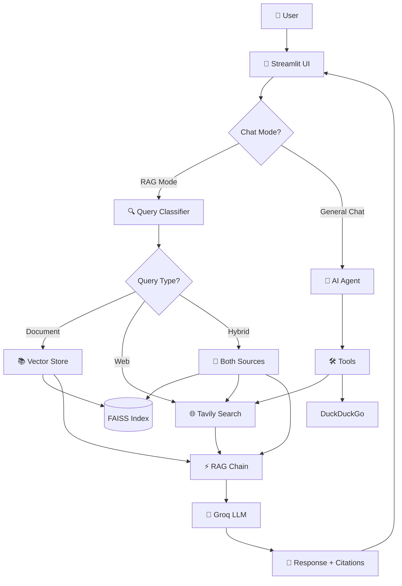

# 🤖 AI Advocate - Hybrid RAG Search Engine

<div align="center">


**A production-ready Hybrid RAG system combining document search with real-time web intelligence**

[Features](#-features) • [Installation](#-installation) • [Usage](#-usage) • [Architecture](#-architecture) • [Contributing](#-contributing)

</div>

---

## 📋 Table of Contents

- [Overview](#-overview)
- [Features](#-features)
- [Architecture](#-architecture)
- [Tech Stack](#-tech-stack)
- [Installation](#-installation)
- [Configuration](#-configuration)
- [Usage](#-usage)
- [Project Structure](#-project-structure)
- [API Reference](#-api-reference)

---

## 🎯 Overview

**AI Advocate** is an enterprise-grade Hybrid RAG (Retrieval-Augmented Generation) system that intelligently combines:

- 📄 **Multi-document semantic search** using FAISS vector database
- 🌐 **Real-time web search** via Tavily API
- 🤖 **Agentic AI** with tool-calling capabilities
- 💬 **Context-aware conversations** with memory

Built for knowledge workers, researchers, and organizations who need to query both internal documents and live web data seamlessly.

### 🎥 What Makes This Special?

Unlike traditional RAG systems that only search documents OR the web, AI Advocate:

✅ **Automatically classifies queries** (document/web/hybrid)  
✅ **Provides source-attributed answers** with transparent citations  
✅ **Supports diverse retrieval** via MMR (Maximal Marginal Relevance)  
✅ **Includes general chat mode** with tool-calling agents  
✅ **Streams responses** for real-time user experience  

---

## ✨ Features

### 🔍 **Hybrid Search Capabilities**

- **Document Search**: Semantic search across uploaded PDFs and text files
- **Web Search**: Real-time information from Tavily search engine
- **Hybrid Mode**: Combines both sources intelligently
- **MMR Search**: Diverse, non-redundant results

### 🤖 **Intelligent Query Routing**

- Automatic query classification (document/web/hybrid)
- Context-aware response generation
- Source attribution and citations
- Confidence scoring

### 💬 **Two Chat Modes**

#### 📚 RAG Mode
- Upload and index documents
- Ask questions about your knowledge base
- Get grounded answers with sources
- Toggle web search on/off
- Choose similarity or MMR retrieval

#### 💭 General Chat Mode
- Conversational AI with tool access
- Web search capabilities
- Calculator tool
- DuckDuckGo search integration
- Persistent conversation memory

### 🎨 **Modern UI/UX**

- Clean Streamlit interface
- Real-time streaming responses
- Expandable source citations
- Evidence tabs (Answer/Documents/Web)
- File upload and management
- Session statistics

---

## 🏗️ Architecture


### Core Components

1. **Document Processor**: Handles PDF/TXT file ingestion
2. **Embedding Manager**: Converts text to vectors (Google Gemini)
3. **Vector Store Manager**: FAISS-based semantic search
4. **Query Classifier**: Routes queries intelligently
5. **RAG Chain**: Orchestrates retrieval and generation
6. **Agent Manager**: Tool-calling conversational AI
7. **Chat Interface**: Streamlit-based UI layer

---

## 🛠️ Tech Stack

| Component | Technology |
|-----------|-----------|
| **Language** | Python 3.10+ |
| **LLM Framework** | LangChain |
| **LLM Provider** | Groq (Llama models) |
| **Embeddings** | Google Gemini |
| **Vector DB** | FAISS |
| **Web Search** | Tavily API |
| **UI Framework** | Streamlit |
| **Agent Framework** | LangGraph |
| **Memory** | LangGraph InMemorySaver |

---

## 📦 Installation

### Prerequisites

- Python 3.10 or higher
- pip package manager
- API keys for:
  - Groq API
  - Google Gemini
  - Tavily Search

### Step 1: Clone Repository
```bash
git clone https://github.com/yourusername/Gen-AI-Project-With-Langchain.git
cd ai-advocate-rag
```

### Step 2: Create Virtual Environment
```bash
# Using venv
python -m venv venv

# Activate (Windows)
venv\Scripts\activate

# Activate (Mac/Linux)
source venv/bin/activate
```

### Step 3: Install Dependencies
```bash
pip install -r requirements.txt
```

### Step 4: Set Up Environment Variables

Create a `.env` file in the project root:
```env
# LLM Configuration
GROQ_API_KEY=your_groq_api_key_here
LLM_MODEL=llama-3.3-70b-versatile
LLM_TEMPERATURE=0.7

# Embeddings
EMBEDDING_MODEL=models/embedding-001

# Search
TAVILY_API_KEY=your_tavily_api_key_here

# Vector Store
FAISS_INDEX_PATH=./data/faiss_index
TOP_K_RESULTS=5
```

### Step 5: Create Required Directories
```bash
mkdir -p data/faiss_index
```

---

## ⚙️ Configuration

### `config/settings.py`

All configuration is centralized in the settings file:
```python
from pydantic_settings import BaseSettings

class Settings(BaseSettings):
    # LLM Settings
    GROQ_API_KEY: str
    LLM_MODEL: str = "llama-3.3-70b-versatile"
    LLM_TEMPERATURE: float = 0.7
    
    # Embeddings
    EMBEDDING_MODEL: str = "models/embedding-001"
    
    # Vector Store
    FAISS_INDEX_PATH: str = "./data/faiss_index"
    TOP_K_RESULTS: int = 5
    
    # Search
    TAVILY_API_KEY: str
    
    class Config:
        env_file = ".env"

settings = Settings()
```

---

## 🚀 Usage

### Starting the Application
```bash
streamlit run app.py
```

The app will open at `http://localhost:8501`

### RAG Chat Mode

1. **Upload Documents**
   - Click "📤 Upload Documents"
   - Select PDF or TXT files
   - Click "🚀 Process Documents"

2. **Configure Search**
   - Toggle "🌐 Enable Web Search" (on/off)
   - Toggle "🔀 Diverse Results (MMR)" (on/off)

3. **Ask Questions**
   - Type your question in the chat input
   - Get AI-generated answers with sources
   - View citations in expandable sections

### General Chat Mode

1. **Switch Mode**
   - Click "💬 Switch to General Chat" in sidebar

2. **Chat with AI**
   - Ask any question
   - AI can use web search tools
   - Conversation has memory

3. **Switch Back**
   - Click "📚 Switch to RAG Chat" to return

---

## 📁 Project Structure
```
ai-advocate-rag/
│
├── app.py                      # Main Streamlit application
├── requirements.txt            # Python dependencies
├── .env                        # Environment variables (not in repo)
├── README.md                   # This file
│
├── config/
│   └── settings.py            # Configuration management
│
├── core/                      # Core business logic
│   ├── __init__.py
│   ├── document_processor.py # Document ingestion
│   ├── embeddings.py          # Embedding generation
│   ├── vector_store.py        # FAISS operations
│   ├── chain.py               # RAG pipeline
│   ├── agent.py               # AI agent with tools
│   └── query_classifier.py    # Query routing
│
├── tools/                     # External tools
│   ├── __init__.py
│   ├── tavily_search.py       # Tavily integration
│   └── tool_for_agent.py      # Agent tools
│
├── ui/                        # UI components
│   ├── __init__.py
│   ├── components.py          # Reusable UI elements
│   └── chat_interface.py      # Chat logic
│
├── data/                      # Data storage
│   └── faiss_index/          # Vector database
│
└── screenshots/               # Demo images
    ├── rag_mode.png
    └── general_mode.png
```

---

## 📚 API Reference

### Core Classes

#### `EmbeddingManager`
```python
from core.embeddings import EmbeddingManager

embedder = EmbeddingManager(model_name="models/embedding-001")
vector = embedder.embeddings.embed_query("Hello world")
```

#### `VectorStoreManager`
```python
from core.vector_store import VectorStoreManager

vector_store = VectorStoreManager()
vector_store.add_documents(documents)
results = vector_store.search("query", k=5)
```

#### `RAGchain`
```python
from core.chain import RAGchain

rag = RAGchain(vector_store_manager)
response = rag.query("What is RAG?")
```

#### `QueryClassifier`
```python
from core.query_classifier import QueryClassifier

classifier = QueryClassifier()
query_type = classifier.classify("Latest AI news")
# Returns: "web", "document", or "hybrid"
```

#### `AgentManager`
```python
from core.agent import AgentManager
from tools.tool_for_agent import get_all_tools

agent = AgentManager()
agent.agent_initialization(tools=get_all_tools())
response = agent.get_response("Search for Python tutorials")
```

---


### ✅ Completed
- [x] Multi-document RAG
- [x] FAISS vector store
- [x] Tavily web search
- [x] Hybrid search mode
- [x] MMR retrieval
- [x] Query classification
- [x] AI agent with tools
- [x] Streamlit UI
- [x] Source citations

</div>
